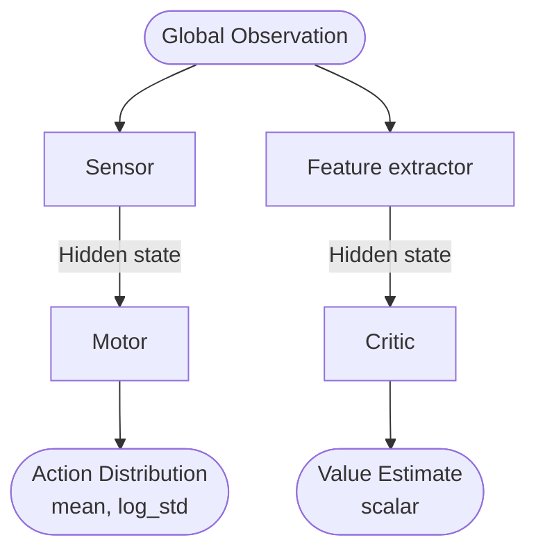
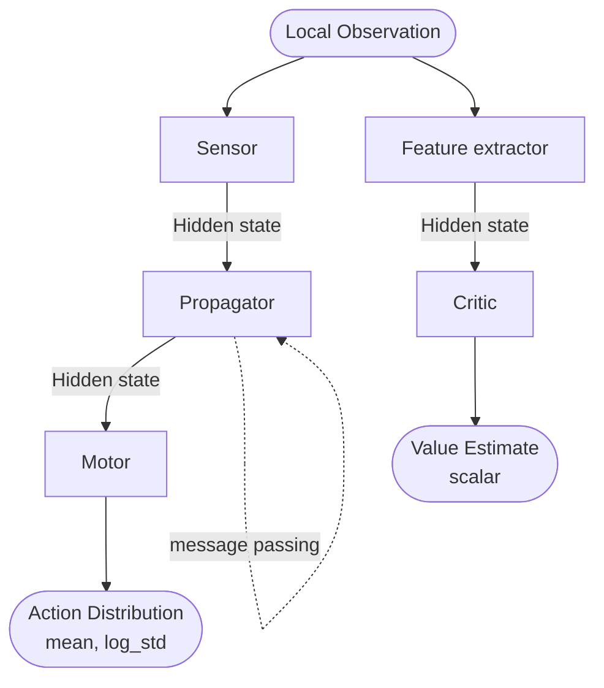

# Actor-Critic Architecture

To process observations into actions, our controllers utilize an Actor-Critic architecture. Because we use Proximal
Policy Optimization (PPO), the pipeline fundamentally requires separate networks for the policy (Actor) and the value
estimation (Critic).

**Centralized Architecture (Baseline)**

This pipeline treats the agent as a single entity and uses standard Proximal Policy Optimization (PPO).

- Centralized Actor: Composed of two chained MLPs (Sensor $\rightarrow$ Motor) passing a hidden state between them. The
  centralized sensor receives the concatenated global state vector of all limbs at once and processes it into a hidden
  state. The centralized motor receives this hidden state and outputs the joint offsets for all actuators
  simultaneously. This is mathematically equivalent to using one large MLP with hidden layers, but splitting makes the
  implementation easier by allowing us to reuse the same components for the decentralized modules.
- Centralized Critic: Composed of two sequential MLPs (Feature Extractor $\rightarrow$ Critic). Because PPO evaluates
  the state-value function, this network only receives the concatenated global state vector (no actions). It outputs a
  single scalar estimating the expected future reward for the entire agent.

Our policy and value networks use separate input networks/feature extractors as advised by the SEL3 course assistants and the blog. For continuous actions this should allow better learning at a small cost.

**Decentralized Architecture**

This pipeline utilizes the "Centralized Training with Decentralized Execution" principle, specifically the NerveNet-MLP
variant.

- Decentralized Actor, split into three distinct models:
  - Sensor: A local model at each node. It receives its local state plus the goal vector directly, processing them into
    an initial hidden state.
  - Propagator: Nodes synchronously compute and exchange messages with connected neighbors for $N$ steps to update
    their hidden states. See [communication.md](./communication.md) for details.
  - Motor: A local model uses its final updated hidden state to output the joint offset strictly for its own actuator.
- Centralized Critic: Composed of two sequential MLPs (Feature Extractor $\rightarrow$ Critic). During training, it
  acts globally by taking the concatenated state vectors from all sensors to output a single, global state-value scalar
  evaluating the entire agent's pose.

To keep the implementation simple, we should use one critic per node in our architecture, but only a single, global
critic for all nodes at once, for the following reasons:

1. Credit Assignment Problem (Ha, 2017): The MuJoCo simulator provides an overall reward based on the brittle star
  movement progression, e.g. total distance travelled. Using an isolated critic for each node in the network would not
  allow to determine which local action contributed to the global success. A global critic solves this by evaluating
  the combined state of the agent at once.
2. Implementation simplicity: Building a second decentralized message-passing graph for the critic (NerveNet-2) would
  require more coding. Using a standard MLP that concatenates all raw input vectors is much easier to program while
  mathematically equivalent.

## Implementation Details (Network Depth)

Inspired by: [PPO Implementation Details](https://iclr-blog-track.github.io/2022/03/25/ppo-implementation-details/)

The MLPs used in both pipelines are defined with specific hidden layer configurations to balance learning capability
and computational cost. As of right now, though this might change as we make progress in our experiments, we use:

- Input Networks (Sensors & Feature Extractors): These networks map the raw state inputs to internal hidden states.
  They are configured as standard dense networks with 3 hidden layers of 300 nodes each (`[300, 300, 300]`) and utilize `tanh`
  activation functions.
- Output Networks (Motors, Actors & Critics): The final output models are intentionally kept shallow. The Actor
  directly projects the hidden state to a continuous action distribution (`mean` and `log_std`) using a single dense
  output layer (zero hidden layers) initialized orthogonally. The Critic functions similarly, mapping the hidden
  representation to a single scalar value.

Note: For the continuous action distributions outputted by the Motor, we explicitly use `mean` and `log_std` as advised
by previous research to maintain learning stability.

**References**

- Ha, D. (2017, October 29). A Visual Guide to Evolution Strategies. 大トロ ・ Machine Learning. [https://blog.otoro.net/2017/10/29/visual-evolution-strategies/](https://blog.otoro.net/2017/10/29/visual-evolution-strategies/)
- Schulman, John, Filip Wolski, Prafulla Dhariwal, Alec Radford, and Oleg Klimov. ‘Proximal Policy Optimization Algorithms’. arXiv:1707.06347. Preprint, arXiv, 28 August 2017. [https://doi.org/10.48550/arXiv.1707.06347](https://doi.org/10.48550/arXiv.1707.06347).
- Wang, Tingwu, Renjie Liao, Jimmy Ba, and S. Fidler. ‘NerveNet: Learning Structured Policy with Graph Neural Networks’. Conference paper presented at International Conference on Learning Representations. 15 February 2018. [https://www.semanticscholar.org/paper/NerveNet:-Learning-Structured-Policy-with-Graph-Wang-Liao/249408527106d7595d45dd761dd53c83e5a02613](https://www.semanticscholar.org/paper/NerveNet:-Learning-Structured-Policy-with-Graph-Wang-Liao/249408527106d7595d45dd761dd53c83e5a02613).
