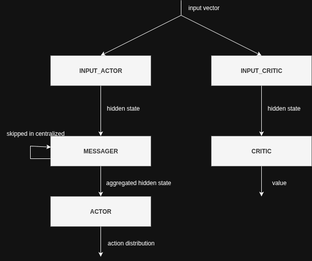

# Network Architecture (MLP Pipeline per Module)

In the decentralized architectures (arm-level and segment-level), each controller/module follows the same **shared MLP-based pipeline** inspired by NerveNet-style message passing. The pipeline consists of 5 MLPs (4 in the case of centralized, with no messager):

- **INPUT_ACTOR**: Processes local observations for the actor branch.
- **INPUT_CRITIC**: Processes local observations for the critic branch.
- **MESSAGER**: Processes incoming hidden states from neighboring modules (via the chosen communication scheme) and produces an aggregated hidden state.
- **ACTOR**: Takes the aggregated hidden state and outputs the action distribution (mean and log_std).
- **CRITIC**: Takes the aggregated hidden state and outputs a scalar value estimate.

## MLP Pipeline

## Implementation Details Related To PPO

Inspired by: https://iclr-blog-track.github.io/2022/03/25/ppo-implementation-details/

For starters we will execute our tests with simple models. Each MLP will have only 1 hidden layer. This will be expanded as needed. The exceptions are the input networks / feature extractors — they will be given 2 hidden layers and 64 nodes per layer as advised in the blog. This might change as we make progress in our experiments.

Our policy and value networks use separate networks as advised by the paper and the blog. For continuous actions this should allow better learning at a small cost.

We use mean and log_std to represent the action distribution, because it is advised by previous research for learning stability and other reasons.